# Trading Application Architecture & Layered Design

## 1. Trading Application High-Level Architecture

```
Market Data → Strategy → Risk → OMS → Execution → Portfolio
```

### Components

#### Market Data Ingestion
- Connects to exchange APIs (REST/WebSocket)
- Normalizes and validates data

#### Market Data Store
- Latest prices (cache)
- Historical data (DB)

#### Caching Layer (TTL Cache)
- Sits inside the Service layer in front of external Market Data calls
- In-memory cache where each entry stores its value plus an absolute expiry timestamp
- Namespaced cache keys, e.g. `investigate:MSFT:1D:30`
- TTL of 300s: repeated requests for the same symbol/timeframe/lookback skip the external API call and DB write
- Responses include a `cached` flag to indicate hit vs miss

#### Trading Algorithm
- Generates BUY/SELL signals
- Implements strategies (e.g. moving average)

#### Risk Management
- Checks limits (position, size)
- Enforces trading rules

#### Order Management System (OMS)
- Creates and tracks orders
- Manages lifecycle

#### Execution Platform
- Sends orders to broker/exchange
- Receives fills and confirmations

#### Portfolio Service
- Tracks positions and P&L

---

## 2. Layered Design (Controller vs Service vs Repository/Client)

```
Controller → Service → Repository / Client
```

### Controller Layer
- Handles API requests
- Validates input
- Calls service layer
- Returns response

Example:
- POST /trade

---

### Service Layer
- Contains business logic
- Implements trading rules
- Orchestrates workflows

Responsibilities:
- Risk checks
- Strategy decisions
- Order creation
- TTL caching of expensive external calls (Market Data Store cache)

---

### Repository Layer
- Handles database operations

Examples:
- Save order
- Retrieve positions

---

### Client Layer
- Handles external API communication

Examples:
- Market data API
- Broker API

---

## 3. End-to-End Flow

1. Market data is received from exchange API
2. Strategy generates a signal
3. Risk engine validates signal
4. OMS creates order
5. Execution client sends order
6. Portfolio updates positions

```mermaid
flowchart TD
    A[Client GET /investigate/&#123;symbol&#125;] --> B[Controller main.py]
    B --> C[Service MarketDataIngestionService]
    C --> D{TTL Cache hit?}
    D -- Yes --> E[Return cached summary cached=true]
    D -- No --> F[Client Layer AlpacaMarketDataClient]
    F --> G[Alpaca Market Data API]
    G --> H[Repository save_bars]
    H --> I[(SQLite market_data.db)]
    H --> J[Store result in TTL Cache 300s]
    J --> K[Return summary cached=false]
    E --> L[Strategy MinMaxWindowStrategy]
    K --> L
    L --> I
    L --> M[Risk Management]
    M --> N[OMS]
    N --> O[Execution Platform]
    O --> P[Portfolio Service]

    classDef notImplemented fill:#ffcccc,stroke:#c0392b,color:#000;
    class M,N,O,P notImplemented;
```



> Red components are defined in the architecture but **not yet implemented**.


---

## 4. Key Principles

- Separation of concerns
- Service layer owns decision-making
- Controller is thin
- Repository handles data only
- Client handles external interactions
- Caching lives in the service layer to shield external APIs (with TTL expiry)

---

## 5. Summary

- Controller = handles request
- Service = business logic
- Repository/Client = data + external systems
